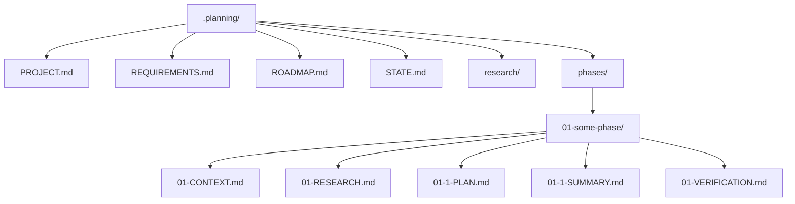

GSD creates files that double as both **state** and **prompt context**.

## Core Files

| File | Role |
|------|------|
| `PROJECT.md` | The project vision. Always loaded. |
| `REQUIREMENTS.md` | Scope with v1/v2 separation. |
| `ROADMAP.md` | Phases mapped to requirements. |
| `STATE.md` | Living memory (decisions, blockers, position). |

## Planning Outputs

| Output | When it appears |
|--------|------------------|
| `{phase}-CONTEXT.md` | After `/gsd:discuss-phase` |
| `{phase}-RESEARCH.md` | During `/gsd:plan-phase` |
| `{phase}-{N}-PLAN.md` | Plans created by the planner |

## Execution Outputs

| Output | When it appears |
|--------|------------------|
| `{phase}-{N}-SUMMARY.md` | After each plan execution |
| `{phase}-VERIFICATION.md` | After execution verification |
| `{phase}-UAT.md` | After `/gsd:verify-work` |

## Typical Directory Shape

<Note>
  These artifacts are the product. They keep future sessions aligned even when the model context window resets.
</Note>
