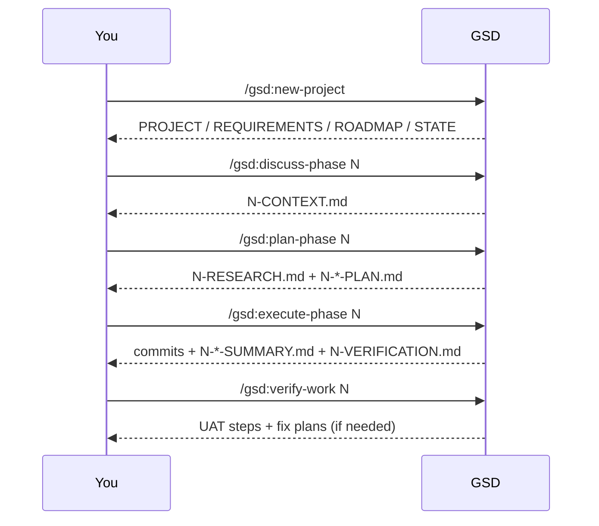
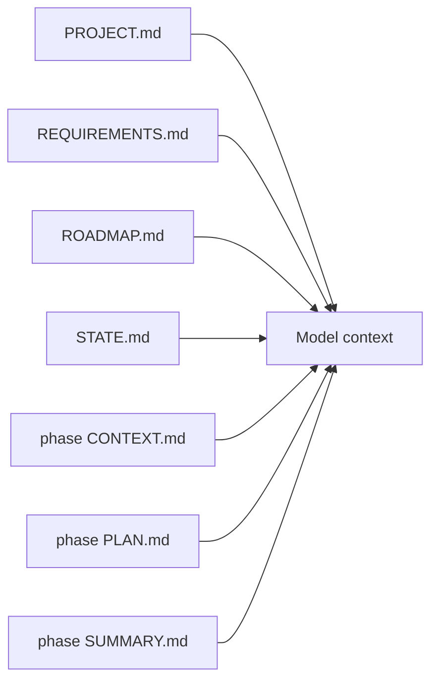

## Workflow Loop

## Prompt Artifact Stack

## Brand Assets (Upstream)

These are in `assets/` in the upstream repo:

- `assets/terminal.svg`
- `assets/gsd-logo-2000.svg`
- `assets/gsd-logo-2000.png`

